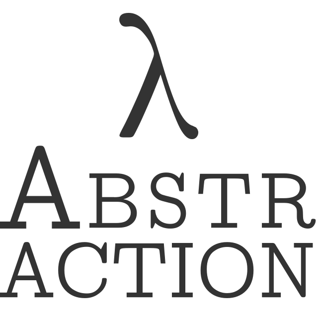

<!-- IGNORE
<p align="center" class="file-vars">
(* -*- title: "λ Abstraction"; theme: "百合" -*- *)
</p>
IGNORE -->

<p align="center"><a href="./"></a></p>

## Episodes

* [Episode 2045-1-22](ep2045-1-22.md)
* [Episode 2045-4-5](ep2045-4-5.md)
* [Episode 2045-4-5a](ep2045-4-5a.md)

## Information

* GitHub: <https://github.com/fairytale/fairytale.github.io>
* Web site: <https://fairytale.github.io/abstr>

## How to get the source code

```
$ git clone git://github.com/fairytale/fairytale.github.io.git
$ cd fairytale.github.io/abstr
```

## Knowledge

* [Knowledge](knowledge.md)
